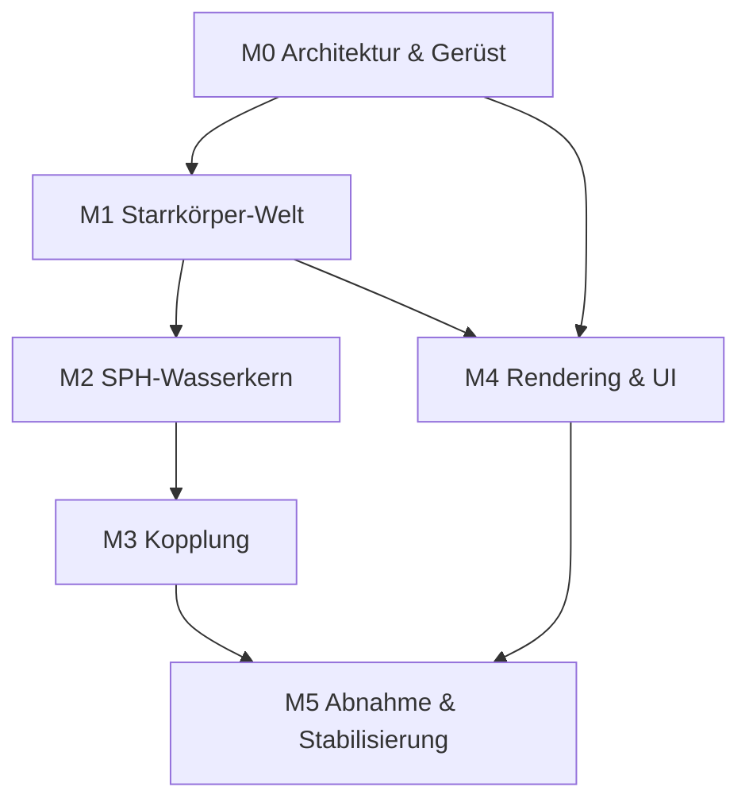

# Umsetzungsplan – SegelPhysik v0.2 (3D-Physiksimulations-Umgebung)

**Basis:** SPEC 1.0 (Stand 09.10.2026) auf `main`
**Ziel:** Definition of Done aus Abschnitt 8 der Spec (10 Akzeptanzkriterien)
**Stand des Plans:** 09.10.2026

---

## 0. Vorgehensmodell

- **Milestone-basiert:** 6 Meilensteine (M0–M5), jeder mit klarer Abnahme.
- **Ein Meilenstein = ein Satz GitHub-Issues**; pro Issue ein PR gegen `main`.
- **Jeder PR muss:** Tests grün haben, keine hart kodierten Physik-Konstanten,
  Spec-Referenz im Beschreibungstext.
- **Feature-Flags statt langer Branches:** Unfertige Teile liegen hinter Flags
  auf `main`, damit die CI stets grün bleibt.

---

## 1. Meilensteine im Überblick

| M | Titel | Kernlieferung | Spec-Bezug |
|---|---|---|---|
| M0 | Architektur & Gerüst | Bibliotheksentscheidung, Paketstruktur, Config-System, CI | §7, §7.1 |
| M1 | Starrkörper-Welt | Body-/Shape-Interface, Kugel/Quader, Kollisionen, Starrkörper-Solver | §4, §5 |
| M2 | SPH-Wasserkern | Fluidsolver hinter Interface, 20k Partikel, CFL, Determinismus | §5 |
| M3 | Kopplung | Auftrieb/Widerstand/Stokes als Kraftmodule, Fluid↔Körper-Impuls | §2–§4 |
| M4 | Rendering & UI | Wasseroberfläche, Gitter, Kontrollpanel, Klick-Spawning | §6 |
| M5 | Abnahme | Akzeptanztests zu allen 10 Kriterien, Szenen-Serialisierung, Doku | §8 |

Abhängigkeitskette: M0 → M1 → M2 → M3 → M4 → M5
(M4 kann ab M1 parallel laufen; Details siehe Diagramm in Abschnitt 3.)

---

## 2. Meilensteine im Detail

### M0 – Architektur & Gerüst

**Ziel-Entscheidungen (dokumentiert im Architektur-Issue):**
1. SPH-Kern: **Taichi** (empfohlen, GPU-Pfad für Kriterium 7) vs. NumPy/Numba (CPU-Fallback).
2. Starrkörper: **PyBullet** vs. eigener impulsbasierter Solver.
   - Hinweis: PyBullet nutzt z-Achse nach oben – passt zur Spec-Konvention.
   - Falls eigener Solver: Kugel-Kugel und Quader-Kollisionen selbst implementieren (Aufwand!).
3. Rendering: **OpenGL-basiert** (z. B. ModernGL/pyrender) oder Taichi-GUI –
   Kriterium: transparente Oberfläche + 30 FPS bei 20k Partikeln.

**Lieferobjekte:**
- Paketstruktur:
  ```
  segelphysik/
    core/        # Simulationskern (KEINE Rendering-Imports!)
      config.py      # Parameterobjekt, JSON/YAML-Ladung
      bodies.py      # Body-Basisklasse, Sphere, Box
      forces.py      # Kraftmodul-Schnittstelle
      fluid.py       # SPH-Interface (abstrakt)
      solver.py      # Kopplung + Zeitschleife (Akkumulator)
    fluid/       # konkrete SPH-Implementierung (Taichi)
    render/      # Visualisierung, UI
    io/          # Szenen-Serialisierung
    tests/
  ```
- `config.json` mit allen Defaults aus der Spec (ρ_W, ρ_L, g, c_w, μ, e,
  Beckenmaße, Δt, Δx, h, Wind) – **einzige Quelle der Wahrheit**.
- CI: pytest-Lauf + Lint bei jedem Push.
- Erste Unit-Tests: Config laden, Parameterzugriff.

**Abnahme M0:** `pip install -e . && pytest` grün; Config lädt alle Spec-Defaults;
Architektur-Entscheidung im Issue begründet.

---

### M1 – Starrkörper-Welt

**Issues:**
1. `Body`-Basisklasse + `Sphere`, `Box` (Masse, Dichte, μ, e, Trägheitstensor).
2. Shape-Methoden: `submerged_volume(waterline)` – Quader analytisch,
   Kugel über Kappenhöhe; `A_ref(direction)`; Trägheitstensor.
3. Starrkörper-Solver: Semi-implizite Euler, Impulsbasierte Kollisionsauflösung
   mit Restitution + Coulomb-Reibung; Wände/Boden/Oberseite-offen.
4. Zeitschleife mit **Akkumulator-Muster** (Δt = 1/240 s, Substep-Obergrenze 8).

**Unit-Tests:** Teilvolumen halb getauchter Quader = 4 m³; Kugel-Kappe gegen
analytische Formel; Kollision zweier Kugeln → Impulserhaltung; Restdurchdringung
< 1 % (→ Kriterium 6 vorbereitet).

**Abnahme M1:** Zwei Körper kollidieren physikalisch plausibel im leeren Raum
(ohne Wasser); Realtime-Factor-Messung vorhanden.

---

### M2 – SPH-Wasserkern

**Issues:**
1. SPH-Interface (`fluid.py`): Partikelzustand lesen/schreiben,
   `density_at(pos)`, `velocity_at(pos)` – Implementierung dahinter austauschbar.
2. Taichi-Implementierung: WCSPH oder IISPH (Entscheidung im Issue mit Begründung),
   h = 1,3·Δx, CFL-Begrenzung 0,3·h/Substep.
3. Initialisierung: Beckengitter aus Config (Δx = 0,25 m → ~19.200 Partikel),
   Seed für Determinismus.
4. Benchmark: 20.000 Partikel @ ≥ 30 FPS (GPU-Pfad); CPU-Fallback mit
   reduzierter Partikelzahl dokumentieren (Risiko aus §7).

**Unit-Tests:** Hydrostatischer Druck am Boden ± 1 % (→ Kriterium 3);
Partikel in Ruhe ohne Körper bleiben stabil (keine Explosion nach 1.000 Substeps);
Determinismus: zwei Läufe, gleicher Seed → Abweichung < 1e-9 (→ Kriterium 9).

**Abnahme M2:** Wasser steht stabil im Becken, Oberfläche aus Partikeln extrahierbar.

---

### M3 – Kopplung (Fluid ↔ Festkörper)

**Issues:**
1. Kraftmodul-Schnittstelle: `apply(body, environment, dt) -> Kraft/Moment`.
2. Module: `Buoyancy` (Archimedes mit Teilvolumen), `WaterDrag`
   (½·ρ_W·c_w·A_ref·v_rel², v_rel gegen lokale SPH-Geschwindigkeit),
   `AirDrag` (dieselbe Form, ρ_L, v_rel gegen Windfeld), `StokesDamping`
   (dokumentiert als Stabilitätshilfe).
3. Windfeld-Interface: homogenes Feld (Azimut + Geschwindigkeit) als erste
   Implementierung – Schnittstelle so, dass v0.3 ortsabhängige Felder einsetzt.
4. Impulsübertrag Körper → Partikel: Penetrationsabstoßung (reicht laut Spec
   für v0.2); Zwei-Wege-Kopplung als dokumentierte Vereinfachung.
5. Auflösungsregel im Einspawner: Körperabmessung ≥ 8·Δx erzwingen.

**Unit-Tests:** Auftrieb halb getauchter Testquader = 39.240 N ± 5 %
(→ Kriterium 2); Terminalgeschwindigkeit gegen analytischen Wert mit
CFL-verträglicher Testkonfiguration (→ Kriterium 4).

**Abnahme M3:** Schwimmende/sinkende Kugeln verhalten sich physikalisch korrekt
(→ Kriterium 1 vorbereitet); Wellen nach Einsprung sichtbar (→ Kriterium 5 vorbereitet).

---

### M4 – Rendering & UI (parallel ab M1 möglich)

**Issues:**
1. Szene: transparente, beleuchtete Wasseroberfläche (Marching Cubes oder
   Partikel-Dichte-Schwellwert), Tiefenfarbe.
2. Koordinatengitter mit Beschriftung + Maßstabsleiste.
3. Kontrollpanel: g, Wind (Richtung/Geschwindigkeit), Pause/Schritt/Reset,
   Partikelanzahl (Restart-Parameter!), Δt, Substeps-Obergrenze, Beckenmaße.
4. Klick-Spawning: Kugel/Quader, Dichte, μ, e wählbar; Mindestgröße ≥ 8·Δx erzwungen.
5. Statusanzeige des gewählten Körpers: Position, Geschwindigkeit, Eintauchtiefe, Kräfte.

**Abnahme M4:** Kriterium 8 erfüllt (Einspawnen per Klick, g/Wind zur Laufzeit änderbar).

---

### M5 – Abnahme & Stabilisierung

**Issues:**
1. Szenen-Serialisierung (Parameter + Körper + Seed speichern/laden) –
   Voraussetzung für automatisierte Akzeptanzläufe.
2. Akzeptanztest-Suite: je Kriterium aus §8 ein automatisierter Test oder ein
   dokumentiertes manuelles Protokoll:
   - K1 Schwimmen/Sinken (automatisch: Gleichgewichtstiefgang + Restwelligkeit)
   - K2 Auftrieb 39.240 N ± 5 % (automatisch)
   - K3 Bodenruck ± 1 % (automatisch)
   - K4 Luftwiderstand/Wind + v_term (automatisch)
   - K5 Wellenamplitude ≥ 2·Δx (semi-automatisch: Amplitudenmessung)
   - K6 Kollisionen (automatisch)
   - K7 Echtzeit-Benchmark (Skript mit FPS-Log)
   - K8 Interaktion (manuelles Protokoll)
   - K9 Reproduzierbarkeit < 1e-9 (automatisch)
   - K10 pytest grün (CI)
3. README: Installation, Bedienung, Architekturüberblick, Bekannte Einschränkungen.
4. Tag `v0.2.0` nach erfolgter Abnahme.

---

## 3. Abhängigkeitsdiagramm



---

## 4. Risiken & Gegenmaßnahmen

| Risiko | Betroffen | Gegenmaßnahme |
|---|---|---|
| 20k Partikel @ 30 FPS auf CPU nicht erreichbar (K7) | M2, M5 | GPU-Pfad (Taichi) priorisieren; CPU-Fallback mit reduzierter Partikelzahl als dokumentierte Abweichung |
| Instabiles SPH bei Körper-Eindringen | M3 | Penetrationsabstoßung sanft dämpfen; CFL strikt einhalten; Substep-Obergrenze |
| PyBullet-Achsenkonvention weicht ab | M1 | z-up prüfen; ggf. Transformation kapseln |
| Marching Cubes zu langsam für Echtzeit | M4 | Fallback: Punktwolke/Dichte-Sphären statt Mesh |
| Eigener Starrkörper-Solver zu aufwändig | M1 | Früh PyBullet-Spike (1 Tag) vor Entscheidung |

---

## 5. Empfohlene Reihenfolge der Issues (GitHub)

1. **Issue 0:** Architektur-Entscheidung (Taichi vs. NumPy/Numba; PyBullet vs. eigen) – Blocker für alles
2. Issue 1: Config-System + Paketgerüst + CI (M0)
3. Issue 2: Body/Shape-Interfaces + Teilvolumen (M1)
4. Issue 3: Starrkörper-Solver + Kollisionen (M1)
5. Issue 4: Akkumulator-Zeitschleife (M1)
6. Issue 5: SPH-Interface + Taichi-Implementierung (M2)
7. Issue 6: Becken-Initialisierung + Determinismus (M2)
8. Issue 7: Kraftmodule (Auftrieb/Widerstand/Stokes) (M3)
9. Issue 8: Windfeld-Interface (M3)
10. Issue 9: Körper→Partikel-Impulsübertrag (M3)
11. Issue 10: Wasseroberflächen-Rendering (M4)
12. Issue 11: Kontrollpanel + Klick-Spawning (M4)
13. Issue 12: Szenen-Serialisierung (M5)
14. Issue 13: Akzeptanztest-Suite K1–K10 (M5)
15. Issue 14: README + Tag v0.2.0 (M5)

---

## 6. Definition of Done (gesamt)

Alle 10 Akzeptanzkriterien aus Spec §8 sind erfüllt und nachweisbar
(automatisiert oder protokolliert), der Tag `v0.2.0` ist gesetzt.
