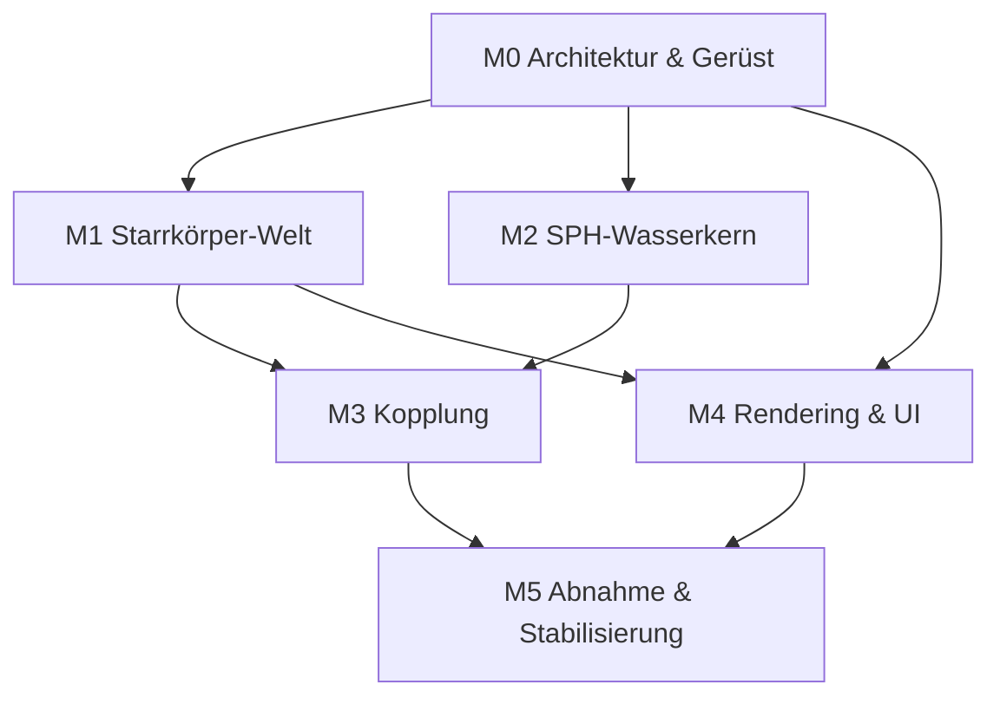

# Umsetzungsplan – SegelPhysik v0.2 (3D-Physiksimulations-Umgebung)

**Basis:** SPEC 1.0 (Stand 09.10.2026) auf `main`
**Ziel:** Definition of Done aus Abschnitt 8 der Spec (10 Akzeptanzkriterien)
**Stand des Plans:** 09.10.2026 · **Plan-Version:** 1.1 (überarbeitet nach Vollprüfung)

**Änderungen gegenüber Plan v1.0:** Issue-Granularität zwischen Meilenstein-
Details und Issue-Liste angeglichen (jetzt durchgängig 17 Issues); Auflösungs-
regel ausschließlich in M4 verankert (war doppelt, mit falscher Reihenfolge);
Abhängigkeitskette im Text an das Diagramm angeglichen (M4 parallel); M3-Abnahme
auf numerischen Wellennachweis umformuliert (Rendering gibt es erst in M4);
M1-Abnahme auf Substep-Durchsatz geändert (Realtime-Fator braucht Renderframes);
Benchmark-Ausführungskontext geklärt (außerhalb der CI); Mermaid-Labels
in Anführungszeichen; K6-Test präzisiert; Issue 1 von Issue 0 entkoppelt.

---

## 0. Vorgehensmodell

- **Milestone-basiert:** 6 Meilensteine (M0–M5), jeder mit klarer Abnahme.
- **Ein Meilenstein = ein Satz GitHub-Issues**; pro Issue ein PR gegen `main`.
- **Jeder PR muss:** Tests grün haben, keine hart kodierten Physik-Konstanten,
  Spec-Referenz im Beschreibungstext.
- **Feature-Flags statt langer Branches:** Unfertige Teile liegen hinter Flags
  auf `main`, damit die CI stets grün bleibt.
- **Issue-Granularität:** Insgesamt 17 Issues (0–16); die Detailabschnitte in
  Abschnitt 2 und die Liste in Abschnitt 5 sind deckungsgleich.

---

## 1. Meilensteine im Überblick

| M | Titel | Kernlieferung | Spec-Bezug | Issues |
|---|---|---|---|---|
| M0 | Architektur & Gerüst | Bibliotheksentscheidung, Paketstruktur, Config-System, CI | §7, §7.1 | 0–1 |
| M1 | Starrkörper-Welt | Body-/Shape-Interface, Kugel/Quader, Kollisionen, Starrkörper-Solver, Zeitschleife | §4, §5 | 2–4 |
| M2 | SPH-Wasserkern | Fluidsolver hinter Interface, 20k Partikel, CFL, Determinismus | §5 | 5–7 |
| M3 | Kopplung | Kraftmodule, Windfeld-Interface, Fluid↔Körper-Impuls | §2–§4 | 8–10 |
| M4 | Rendering & UI | Wasseroberfläche, Gitter, Kontrollpanel, Klick-Spawning, Statusanzeige | §6 | 11–14 |
| M5 | Abnahme | Akzeptanztests zu allen 10 Kriterien, Szenen-Serialisierung, Doku | §8 | 15–16 |

Parallelisierung: M4 kann ab M1 laufen; M2 kann bereits ab M0 parallel zu M1
laufen (der SPH-Kern braucht nur Config und Interface, keine Körper).
Details siehe Diagramm in Abschnitt 3.

---

## 2. Meilensteine im Detail

### M0 – Architektur & Gerüst (Issues 0–1)

**Ziel-Entscheidungen (dokumentiert im Architektur-Issue):**
1. SPH-Kern: **Taichi** (empfohlen, GPU-Pfad für Kriterium 7) vs. NumPy/Numba (CPU-Fallback).
2. Starrkörper: **PyBullet** vs. eigener impulsbasierter Solver.
   - Hinweis: PyBullet nutzt z-Achse nach oben – passt zur Spec-Konvention.
   - Falls eigener Solver: Kugel-Kugel und Quader-Kollisionen selbst implementieren (Aufwand!).
3. Rendering: **OpenGL-basiert** (z. B. ModernGL/pyrender) oder Taichi-GUI –
   Kriterium: transparente Oberfläche + 30 FPS bei 20k Partikeln.

**Lieferobjekte:**
- Paketstruktur:
  ```
  segelphysik/
    core/        # Simulationskern (KEINE Rendering-Imports!)
      config.py      # Parameterobjekt, JSON/YAML-Ladung
      bodies.py      # Body-Basisklasse, Sphere, Box
      forces.py      # Kraftmodul-Schnittstelle
      fluid.py       # SPH-Interface (abstrakt)
      solver.py      # Kopplung + Zeitschleife (Akkumulator)
    fluid/       # konkrete SPH-Implementierung (Taichi)
    render/      # Visualisierung, UI
    io/          # Szenen-Serialisierung
    tests/
  ```
- `config.json` mit allen Defaults aus der Spec (ρ_W, ρ_L, g, c_w, μ, e,
  Beckenmaße, Δt, Δx, h, Wind) – **einzige Quelle der Wahrheit**.
- CI: pytest-Lauf + Lint bei jedem Push.
- Erste Unit-Tests: Config laden, Parameterzugriff.

**Abnahme M0:** `pip install -e . && pytest` grün; Config lädt alle Spec-Defaults;
Architektur-Entscheidung im Issue begründet.

---

### M1 – Starrkörper-Welt (Issues 2–4)

**Issues:**
- **Issue 2:** `Body`-Basisklasse + `Sphere`, `Box` (Masse, Dichte, μ, e,
  Trägheitstensor) sowie Shape-Methoden: `submerged_volume(waterline)` –
  Quader analytisch, Kugel über Kappenhöhe; `A_ref(direction)`.
- **Issue 3:** Starrkörper-Solver: Semi-implizite Euler, impulsbasierte
  Kollisionsauflösung mit Restitution + Coulomb-Reibung; Wände/Boden,
  Oberseite offen.
- **Issue 4:** Zeitschleife mit **Akkumulator-Muster** (Δt = 1/240 s,
  Substep-Obergrenze 8) + Substep-Durchsatz-Messung.

**Unit-Tests:** Teilvolumen halb getauchter Quader = 4 m³; Kugel-Kappe gegen
analytische Formel; Kollision zweier Kugeln → Impulserhaltung; maximale
Restdurchdringung < 1 % der kleinsten charakteristischen Abmessung des
kleineren Körpers (→ Kriterium 6 vorbereitet, volle Präzision aus Spec §8.6).

**Abnahme M1:** Zwei Körper kollidieren physikalisch plausibel im leeren Raum
(ohne Wasser); Substep-Durchsatz messbar (≥ 240 Substeps/s = Realtime-Fähigkeit
des Solvers; der eigentliche Realtime-Factor wird erst mit Renderframes in M4
messbar).

---

### M2 – SPH-Wasserkern (Issues 5–7)

**Issues:**
- **Issue 5:** SPH-Interface (`fluid.py`): Partikelzustand lesen/schreiben,
  `density_at(pos)`, `velocity_at(pos)` – Implementierung dahinter austauschbar.
- **Issue 6:** Taichi-Implementierung: WCSPH oder IISPH (Entscheidung im Issue
  mit Begründung), h = 1,3·Δx, CFL-Begrenzung 0,3·h/Substep.
- **Issue 7:** Initialisierung: Beckengitter aus Config (Δx = 0,25 m →
  ~19.200 Partikel), Seed für Determinismus.

**Unit-Tests:** Hydrostatischer Druck am Boden ± 1 % (→ Kriterium 3);
Partikel in Ruhe ohne Körper bleiben stabil (keine Explosion nach 1.000 Substeps);
Determinismus: zwei Läufe, gleicher Seed → Abweichung < 1e-9 (→ Kriterium 9,
auf Fluid-Ebene; Szenen-weit in M5).

**Benchmark (Kriterium 7):** 20.000 Partikel @ ≥ 30 FPS. **Ausführungskontext:**
als manuell ausführbares Benchmark-Skript mit FPS-Log – **nicht** als
CI-Pflichttest (GitHub-Runner haben keine dedizierte GPU); Ergebnis wird im
Issue dokumentiert. CPU-Fallback mit reduzierter Partikelzahl dokumentieren
(Risiko aus Spec §7).

**Abnahme M2:** Wasser steht stabil im Becken, Oberfläche aus Partikeln
extrahierbar, Benchmark-Ergebnis dokumentiert.

---

### M3 – Kopplung, Fluid ↔ Festkörper (Issues 8–10)

**Issues:**
- **Issue 8:** Kraftmodul-Schnittstelle (`apply(body, environment, dt) ->
  Kraft/Moment`) + Module: `Buoyancy` (Archimedes mit Teilvolumen),
  `WaterDrag` (½·ρ_W·c_w·A_ref·v_rel², v_rel gegen lokale SPH-Geschwindigkeit),
  `AirDrag` (dieselbe Form, ρ_L, v_rel gegen Windfeld), `StokesDamping`
  (dokumentiert als Stabilitätshilfe).
- **Issue 9:** Windfeld-Interface: homogenes Feld (Azimut + Geschwindigkeit)
  als erste Implementierung – Schnittstelle so, dass v0.3 ortsabhängige
  Felder einsetzt.
- **Issue 10:** Impulsübertrag Körper → Partikel: Penetrationsabstoßung
  (reicht laut Spec für v0.2); Zwei-Wege-Kopplung als dokumentierte
  Vereinfachung.

*(Die Auflösungsregel „Körperabmessung ≥ 8·Δx" wird ausschließlich in M4 im
Einspawner erzwungen – siehe Issue 13; der Einspawner existiert in M3 noch nicht.)*

**Unit-Tests:** Auftrieb halb getauchter Testquader = 39.240 N ± 5 %
(→ Kriterium 2); Terminalgeschwindigkeit gegen analytischen Wert mit
CFL-verträglicher Testkonfiguration (→ Kriterium 4).

**Abnahme M3:** Schwimmende/sinkende Kugeln verhalten sich physikalisch korrekt
(→ Kriterium 1 vorbereitet); Wellen nach Einsprung **numerisch nachweisbar**
(Amplitude ≥ 2·Δx aus den Partikeldaten – die visuelle Darstellung folgt in M4;
→ Kriterium 5 vorbereitet).

---

### M4 – Rendering & UI (Issues 11–14; parallel ab M1 möglich)

**Issues:**
- **Issue 11:** Szene: transparente, beleuchtete Wasseroberfläche (Marching
  Cubes oder Partikel-Dichte-Schwellwert), Tiefenfarbe.
- **Issue 12:** Koordinatengitter mit Beschriftung + Maßstabsleiste;
  Realtime-Factor-Anzeige (jetzt sind Renderframes vorhanden).
- **Issue 13:** Kontrollpanel (g, Wind Richtung/Geschwindigkeit, Pause/Schritt/
  Reset, Partikelanzahl als Restart-Parameter, Δt, Substeps-Obergrenze,
  Beckenmaße) **und** Klick-Spawning (Kugel/Quader, Dichte, μ, e wählbar)
  mit erzwungener Mindestgröße ≥ 8·Δx (Auflösungsregel aus Spec §4).
- **Issue 14:** Statusanzeige des gewählten Körpers: Position, Geschwindigkeit,
  Eintauchtiefe, resultierende Kräfte.

**Abnahme M4:** Kriterium 8 erfüllt (Einspawnen per Klick, g/Wind zur Laufzeit
änderbar); Realtime-Factor ≈ 1 im Zusammenspiel gemessen.

---

### M5 – Abnahme & Stabilisierung (Issues 15–16)

**Issues:**
- **Issue 15:** Szenen-Serialisierung (Parameter + Körper + Seed speichern/
  laden) – Voraussetzung für automatisierte Akzeptanzläufe (Spec §7.1, §8.9).
- **Issue 16:** Akzeptanztest-Suite + README + Tag:
  - je Kriterium aus Spec §8 ein automatisierter Test oder ein dokumentiertes
    manuelles Protokoll:
    - K1 Schwimmen/Sinken (automatisch: Gleichgewichtstiefgang + Restwelligkeit)
    - K2 Auftrieb 39.240 N ± 5 % (automatisch)
    - K3 Bodenruck ± 1 % (automatisch)
    - K4 Luftwiderstand/Wind + v_term (automatisch)
    - K5 Wellenamplitude ≥ 2·Δx (semi-automatisch: Amplitudenmessung)
    - K6 Kollisionen, Restdurchdringung < 1 % der kleinsten charakteristischen
      Abmessung (automatisch)
    - K7 Echtzeit-Benchmark (Skript mit FPS-Log, außerhalb der CI – siehe M2)
    - K8 Interaktion (manuelles Protokoll)
    - K9 Reproduzierbarkeit < 1e-9, szenenweit über Serialisierung (automatisch)
    - K10 pytest grün (CI)
  - README: Installation, Bedienung, Architekturüberblick, Bekannte Einschränkungen.
  - Tag `v0.2.0` nach erfolgter Abnahme.

**Abnahme M5:** Alle 10 Kriterien nachweisbar; Tag gesetzt.

---

## 3. Abhängigkeitsdiagramm



Hinweis: M2 hängt nur an M0 (Config + Interface) und kann parallel zu M1
laufen; M3 braucht M1 (Körper) **und** M2 (Fluid). M4 kann ab M1 starten,
die Wasseroberflächen-Darstellung (Issue 11) erst ab M2.

---

## 4. Risiken & Gegenmaßnahmen

| Risiko | Betroffen | Gegenmaßnahme |
|---|---|---|
| 20k Partikel @ 30 FPS auf CPU nicht erreichbar (K7) | M2, M5 | GPU-Pfad (Taichi) priorisieren; CPU-Fallback mit reduzierter Partikelzahl als dokumentierte Abweichung |
| Instabiles SPH bei Körper-Eindringen | M3 | Penetrationsabstoßung sanft dämpfen; CFL strikt einhalten; Substep-Obergrenze |
| PyBullet-Achsenkonvention weicht ab | M1 | z-up prüfen; ggf. Transformation kapseln |
| Marching Cubes zu langsam für Echtzeit | M4 | Fallback: Punktwolke/Dichte-Sphären statt Mesh |
| Eigener Starrkörper-Solver zu aufwändig | M1 | Früh PyBullet-Spike (1 Tag) vor Entscheidung |
| Benchmark in CI nicht reproduzierbar (keine GPU auf Runnern) | M2, M5 | Benchmark als manuelles Skript mit dokumentiertem Ergebnis, nicht als CI-Gate |

---

## 5. Issue-Liste (GitHub, 17 Issues)

1. **Issue 0:** Architektur-Entscheidung (Taichi vs. NumPy/Numba; PyBullet vs. eigen) – Blocker für M1–M4
2. Issue 1: Config-System + Paketgerüst + CI (M0) – *unabhängig von Issue 0, kann parallel*
3. Issue 2: Body/Shape-Interfaces + Teilvolumen (M1)
4. Issue 3: Starrkörper-Solver + Kollisionen (M1)
5. Issue 4: Akkumulator-Zeitschleife + Durchsatzmessung (M1)
6. Issue 5: SPH-Interface (M2)
7. Issue 6: Taichi-SPH-Implementierung (M2)
8. Issue 7: Becken-Initialisierung + Determinismus + Benchmark-Skript (M2)
9. Issue 8: Kraftmodul-Schnittstelle + Kraftmodule (M3)
10. Issue 9: Windfeld-Interface (M3)
11. Issue 10: Körper→Partikel-Impulsübertrag (M3)
12. Issue 11: Wasseroberflächen-Rendering (M4)
13. Issue 12: Koordinatengitter + Realtime-Factor-Anzeige (M4)
14. Issue 13: Kontrollpanel + Klick-Spawning inkl. Auflösungsregel (M4)
15. Issue 14: Statusanzeige Körperwerte (M4)
16. Issue 15: Szenen-Serialisierung (M5)
17. Issue 16: Akzeptanztest-Suite K1–K10 + README + Tag v0.2.0 (M5)

---

## 6. Definition of Done (gesamt)

Alle 10 Akzeptanzkriterien aus Spec §8 sind erfüllt und nachweisbar
(automatisiert oder protokolliert), der Tag `v0.2.0` ist gesetzt.
