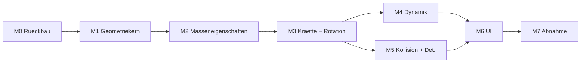

# Umsetzungsplan v2 – SegelPhysik: Hydrostatik inhomogener Körper

**Basis:** doc/SPEC_v2.md, Version 2.3 (Tag: `spec-v2.3`) · **Datum:** 10.10.2026
**Gültigkeit:** Dieser Plan operacionalisiert SPEC v2.3. Bei Konflikt gilt die Spec.
**Gesamtaufwand:** ca. 8–11 Arbeitstage (Richtwerte, inkl. Tests je Meilenstein).

---

## 0. Leitlinien

- **Ein Meilenstein = ein Branch = grüne Suite + Demo vor Merge** auf `main`.
- Spec-Treue vor Eleganz: Abweichungen von SPEC v2.3 werden im PR dokumentiert
  und brauchen Freigabe, bevor sie umgesetzt werden.
- Jede Zahl aus Spec §8 (Sollwerte, Referenzmomente) wandert als **Fixture**
  in die Test-Suite – nicht als hardcodierte Konstante im Solver.
- Der SPH-Code wird NICHT gelöscht, nur aus der Physikschleife genommen
  (Spec §2). Entfernungen betreffen nur aktive Verdrahtung und UI.

## 1. Meilensteine

### M0 – Vorbereitung & Rückbau (0,5 Tag)
| Aufgabe | Detail |
|---|---|
| Branch `v2` anlegen | Basis: main @ spec-v2.3 |
| Kraftmodule deaktivieren | Wind, Drag, Stokes aus aktiver Modulliste; Code bleibt hinter §7.1-Interface |
| SPH aus Physikschleife nehmen | Fluid-Interface bleibt, Kern ruht; Marching-Cubes-Rendering stilllegen |
| UI-Rückbau | Wind-Regler, Partikelanzahl, Δx/h entfernen |
| Doku | README-Hinweis „Spec v2.3 verbindlich", ACCEPTANCE.md auf K1′–K13′ umbenennen (Inhalte folgen je Meilenstein) |

Abnahmekriterium: bestehende Suite nach Rückbau noch grün (nur entfallende
Tests laut Spec §10 sind gelöscht/skip-markiert).

### M1 – Geometriekern: exakte Eintauchgeometrie (2–3 Tage) ⚠️ kritischer Pfad
| Aufgabe | Detail |
|---|---|
| Polyeder-Ebenen-Clip | Dreiecks-Mesh vs. Ebene z = 0 (Weltframe); Clip gegen Halbebene z ≤ 0 |
| V_sub | Divergenzsatz über geclipptes Polyeder |
| r_B | flächengewichtete Integration der geschlossenen Teilmantelflächen |
| Mesh-Vereinigung | Primitive → geschlossene Körpermesh; Überlappungsregel aus §4.2 (erstes Primitive prioritär) dokumentiert umsetzen |
| Kugel-Schnellpfad | geschlossene Kappenformel (rotationsinvariant), als Alternative zulässig (§5.2) |
| Voxel-Debug | Sampling-Modul NUR als Debug-Werkzeug, klar gekennzeichnet |

Tests (neu, Spec §10): Winkel-Sweep 0°–90° in 5°-Schritten gegen analytische
Referenzen (Kugelkappe, gekippter Kegelstumpf, geclippter Quader) → **K13′**,
Toleranz ≤ 0,1 %. Zusätzlich: V_sub-Konsistenz Clip vs. Kappenformel bei der
Referenzkugel.

Abnahmekriterium: K13′ grün. **Kein weiterer Meilenstein startet vor M1** –
K7′, K5′, K6′ und das Status-Panel hängen direkt daran.

### M2 – Integrierte Masseneigenschaften (1 Tag)
| Aufgabe | Detail |
|---|---|
| Primitive-Summe | m_i = ρ_i·V_i, Schwerpunkt, Tensor je Primitive + Steiner-Term (§5.1) |
| Kegel mit linearem Profil | geschlossene Ausdrücke aus §8.1 implementieren |
| Tensor-Handling | Speicherung im Körperframe, Transformation I_welt = R·I·Rᵀ |
| Serialisierung | Dichteverteilungen in Szenen-JSON (§4.3), Roundtrip-Test |

Tests: Bojenkegel-Sollwerte (m = 300π, r_S = 4/3 m) → **K4′** < 0,1 %;
zusammengesetzter Körper gegen numerische Quadratur; homogene Kugel als
Regression (m = ρ·V, r_S = Mittelpunkt).

### M3 – Kraftmodule & Solver-Rotation (1–2 Tage)
| Aufgabe | Detail |
|---|---|
| Buoyancy | F_A = ρ_W·V_sub·g·ẑ angreifend in r_B (§5.3) |
| Gravity | F_G = −m·g·ẑ in r_S |
| LinearDamping | F_d = −c·v, Default c = 2000 N·s/m, abschaltbar, eigenes Modul (§5.4) |
| Rotation | Quaternion-Integration, Kreiselterm ω×(Iω), Renormierung (§5.6) |
| Druck-Interface | p(z) = ρ_W·g·h exakt abfragbar (§2) |

Tests: statischer Auftrieb Quader 2×2×2 halb eingetaucht = 39.240 N → **K2′**;
Druck-Interface → **K3′**; Quaternion-Renormierung & Kreiselterm-Konsistenz;
Gegenprobe c = 0 → konservatives System (Energie konstant).

### M4 – Dynamik-Szenarien & Stabilität (1–2 Tage)
| Aufgabe | Detail |
|---|---|
| Referenzmoment-Fixtures | §8.2-Werte (32,9 / 84,5 / 175,5 / 404,3 N·m) als Testdaten |
| Statische Krängung | Simulation um S bei V_sub = konstant (Sekantenverfahren wie Anhang A) → **K7′** ± 2 % |
| Tauch-Oszillation | Kegel aus +5/+15 cm Versatz → stationärer Tiefgang 1,5326 m → **K5′** (Fenster 15–20 s) |
| Aufrichten | invertiert gespawnter Kegel → Endkrängung < 5° in 20 s → **K6′** |
| Regression Kugeln | ρ = 500 / 2000 kg/m³, Gleichgewichtsgrößen → **K1′** |
| **c_rot-Entscheidung** | zu Beginn von M4 (Spec §5.4): 20-s-Testlauf invertierter Kegel; falls K6′ ohne Rotationsdämpfung scheitert → M_d = −c_rot·ω aktivieren; Ergebnis in Testreport |

### M5 – Kollisionen, Determinismus, Parameter (1 Tag)
| Aufgabe | Detail |
|---|---|
| Kollisionen | Körper↔Körper, Wände/Boden; μ = 0,5, e = 0,3 (UI-änderbar) → **K8′** |
| Reproduzierbarkeit | 1.000 Substeps, Abweichung < 1e-9 → **K9′** |
| Parameterobjekt | g, c, μ, e, Dichteprofile, Beckenmaße – JSON/YAML, keine hartcodierten Konstanten (§7.1) |

### M6 – Visualisierung & UI (1–2 Tage)
| Aufgabe | Detail |
|---|---|
| Wasseroberfläche | statische, transparente Ebene z = 0, Tiefenfärbung (§6) |
| Zweiton-Körper | unter/über Wasserlinie + Wasserlinien-Kontur gegen z = 0 |
| Kraftpfeile | Auftrieb ab r_B, Gewicht ab r_S, Geschwindigkeit ab r_S; optional Momentenarm r_S↔r_B; Skalierung/Farben wie v0.4 |
| Status-Panel | Position, \|v\|, Orientierung, Tiefgang, V_sub, m, r_S, r_B, Kraft, Moment, GM-Schätzwert |
| Kontrollpanel | g, c (inkl. 0 = aus), μ, e, Zeitsteuerung, Spawn-Presets („Homogene Kugel", „Bojenkegel", „Ballast-Kiel-Quader"), Beckenmaße |
| Interaktion | Klick-Spawn, g/c zur Laufzeit änderbar → **K11′** |

### M7 – Abnahme & Release (1 Tag)
| Aufgabe | Detail |
|---|---|
| Komplett-Durchlauf | K1′–K13′ gegen die Spec, Protokoll in ACCEPTANCE.md |
| Echtzeit | ≥ 10 Körper inkl. Bojenkegel bei ≥ 60 FPS → **K10′** (manuell, Hardware-abhängig) |
| Suite | alle Tests grün → **K12′** |
| Release | RELEASE_NOTES_v0.5.md, Merge nach main, Tag `release-v0.5` |

## 2. Abhängigkeitsgraph

Kritischer Pfad: M0 → M1 → M2 → M3 → M4 → M7. M5 kann parallel zu M4 laufen.

## 3. Zuordnung Abnahmekriterien → Meilenstein

| Kriterium | Meilenstein | Art |
|---|---|---|
| K1′, K5′, K6′, K7′ | M4 | dynamisch |
| K2′, K3′ | M3 | statisch |
| K4′, K13′ | M1/M2 | analytisch |
| K8′, K9′ | M5 | numerisch |
| K10′ | M7 | manuell |
| K11′ | M6 | manuell/QUICK |
| K12′ | M7 | Suite |

## 4. Risikoregister

| Risiko | Wahrsch. | Wirkung | Gegenmaßnahme |
|---|---|---|---|
| Exakter Clip bei überlappenden Primitiven komplexer als gedacht | mittel | M1 verzögert sich | Überlappungen in v2 durch Validierung beim Laden ausschließen (§4.2-Regel strikt anwenden); Union-Mesh erst als v3-Posten prüfen |
| K6′ schwingt ohne Rotationsdämpfung nicht ein | mittel | K6′ rot | c_rot-Entscheidung bewusst am ANFANG von M4 (Spec §5.4), nicht am Ende |
| Vorzeichen-/Konventionsfehler Quaternion/Tensor | mittel | falsche Drehrichtung | K7′-Vorzeichenprüfung (aufrichtend positiv) + Kegel stabil/instabil-Gegenprobe früh in M3 |
| Metazentrum-Näherung als versehentliche Physikquelle | niedrig | doppelte Implementierung | Spec §5.3: Formel NUR in Tests; Code-Review-Checkliste |
| float32-Reste aus GPU-Pfad | niedrig | Genauigkeit < 0,1 % | v2-Solver rein NumPy float64 (Spec §7); Taichi erst wieder in Ausbaustufen |

## 5. Arbeitsvereinbarungen

- Commit-Style: `M<n>: <kurz>` + Spec-Referenz im Body (z. B. „implements SPEC v2.3 §5.2").
- Jede Spec-Abweichung → Issue mit Label `spec-deviation`, Freigabe vor Merge.
- Testreport pro Meilenstein: welche Kriterien neu grün, offene Punkte.
- Nach M7: Retro – stimmen die Aufwandsschätzungen, was wandert nach v2.1/v3?
