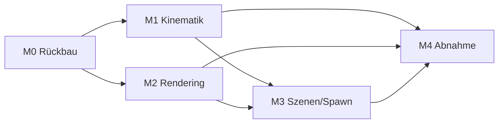

# Umsetzungsplan v3 – SegelPhysik: Kinematische Körperdemo

> ## ⚠️ VORBEMERKUNG – VORRANGIGE ANWEISUNG (gilt vor allen Abschnitten dieses Plans)
>
> **ALLE Dateien, Funktionen, Klassen, Module und sonstigen Bestandteile, die
> Physik beinhalten, werden LÖSCHUNGSPFlichtig behandelt und sind zu ENTFERNEN
> (nicht: zu deaktivieren).** Dies umfasst insbesondere:
>
> - Kraft- und Solver-Module (`core/forces.py`, `core/solver.py`, `core/bodies.py`
>   in ihrer physikalischen Form), SPH-Kern und Fluid-Code (`core/sph.py`,
>   `core/fluid.py`, `fluid/`), Kollisionsbehandlung, Druckfeld, Dichte- und
>   Massenintegration (Masse, Schwerpunkt, Trägheitstensor), Auftrieb,
>   Auftriebsmoment, Dämpfungsterme, alle zugehörigen Parameter und UI-Regler
>   sowie alle Physik-Tests.
> - **Löschen heißt löschen:** kein Auskommentieren, kein Feature-Flag, kein
>   „ruhender Code". Bestandteile, die nur Physik enthalten, werden aus dem
>   Quellbestand entfernt. (Abweichend davon darf *rein grafischer* Code –
>   Rendering, Meshes, Kamera, HUD – selbstverständlich bleiben.)
> - **AUSCHLIESSLICH die GRAFIK wird übernommen:** Rendering-Pipeline, Zweiton-
>   Körper, Wasserlinien-Kontur, Tiefenfärbung, Gitter, Maßstabsleiste, HUD,
>   Wasserebene als statische Fläche bei z = 0 – unverändert aus dem Stand v0.4.
> - **Das Koordinatensystem bleibt:** rechtshändig, z nach oben, Ursprung auf
>   der Wasseroberfläche, x Richtung Bug, y nach Backbord; Becken 10×10×9 m;
>   SI-Einheiten. Es wird nicht geändert und nicht neu definiert.
>
> Jede Aufgabe in den Abschnitten 1–5 ist im Lichte dieser Vorbemerkung zu
> lesen. Bei Konflikt gilt die Vorbemerkung vor dem Abschnittstext.

**Status:** Verbindlicher Umsetzungsplan zu SPEC_v3.md (Version 3.0)
**Datum:** 10.10.2026
**Basis:** doc/SPEC_v3.md (Version 3.0) · ersetzt doc/UMSETZUNGSPLAN_v2.md vollständig
(M1–M5 der v2-Planung entfallen mit der Physik; nur M6-Teile und M7 leben in
angepasster Form weiter – siehe M3/M4 hier)

---

## 0. Leitlinien

1. **Löschgebot vorrangig:** Gemäß Vorbemerkung wird physikbehafteter Code
   gelöscht, nicht deaktiviert. Die Abnahme prüft nur, was in SPEC_v3.md steht;
   zusätzlich gilt: die App lädt keine Physik-Module mehr, und die entsprechenden
   Dateien existieren im Branch `v3` nicht mehr.
2. **Ein Meilenstein = ein Branch = ein Testreport.** Commit-Style:
   `[v3][M<n>] <Kurzbeschreibung> (SPEC_v3 §<x>)`.
3. **Die Animation ist eine geschlossene Funktion der Uhr** – keine Zustands-
   gleichungen, kein Integrator. Alles, was nicht aus φ(t) = ω·t folgt, ist
   ein Fehler gegen §4.
4. Physik-Rückkehr ist V4-Vorbehalt (Spec §10): keine Brücken bauen, die es
   erschweren, die Physik später sauber neu zu spezifizieren.

---

## 1. Meilensteine

### M0 – Branch, Löschung der Physik & UI-Rückbau (≈ 0,5 d)
Branch `v3` von `main` anlegen.
- App-Einstiegspfad reduzieren: keine Solver-, Forces-, Fluid-Imports mehr.
- UI-Rückbau: g-Regler, Dämpfung c, μ/e, Dichteprofil-Parameter, Wind-Regler
  entfernen (Spec §6). Kontrollpanel reduziert auf: Spawn-Auswahl (3 Körper),
  Start/Pause/Reset, Wiedergabefaktor 0,25×–4×, Kamera.
- Status-Panel auf Animationsgrößen reduzieren (Spec §5): Körpertyp, φ(t),
  Umdrehungsnummer, Animationszeit, RTF, FPS.
- Kraft-/Geschwindigkeitspfeile und Momentenarm aus dem Renderpfad nehmen.
- Alte Physik-Tests aus der Suite nehmen (Spec §9 „Entfallen"); Suite muss
  danach grün sein.
- **Abnahme:** App startet ohne Physik-Imports; Suite grün.

### M1 – Kinematik-Kern (≈ 0,5 d) ⚠️ Herzstück
Neu `segelphysik/core/kinematics.py`:
- φ(t) = ω·t, ω = 2π/15 rad/s (aus Szenen-JSON konfigurierbar),
  Drehachse default Welt-y durch r_S, r_S fixiert (0,0,0) (D1/D2),
  φ(0) = 0 ⇒ aufrecht (D3), Reset setzt t = 0.
- Animationsuhr: Δt = 1/240 s Akkumulator-Muster (aus v2.3 übernommen),
  Pause/Single-Step friert die Uhr ein, Wiedergabefaktor skaliert ω effektiv
  (Zeitlupe = kleinere φ-Schritte, exakt derselbe Pfad).
- Quaternion/Orientierungsmatrix je Substep aus φ(t) geschlossen berechnet
  (kein Integrator!) – deterministisch und reproduzierbar.
- **Tests:** φ(15 s) = 360° ± 0,01° (K1″); r_S konstant ± 1 mm (K2″);
  bitidentische φ(t)-Folgen über 1.000 Substeps (K7″); Pause/Step-Verhalten;
  Wiedergabefaktor-Skalierung; JSON-Rundtrip (Körper, Achse, ω, Startphase).

### M2 – Rendering-Anpassungen (≈ 1 d)
- Zweiton-Färbung gegen Ebene z = 0 rein geometrisch: Mesh-Vertices mit
  z < 0 = „unter Wasser" (Spec §5 – Wortlaut „Schwerpunktz" ist im Review als
  „Vertex-z" präzisiert). Kein Physik-Zugriff.
- Wasserlinien-Kontur: Schnittkurve Körper ∩ Ebene z = 0 je Frame, alle drei
  Körpertypen, mindestens 5 Prüfphasen automatisiert (K4″).
- Tiefenfärbung, Gitter, Maßstabsleiste, HUD, Becken: unverändert übernehmen.
- Z-Fighting an der Ebene prüfen (kleiner Polygon-Offset der Wasserebene,
  falls nötig) – K5″.
- **Tests:** Stichproben-Vertex-Klassifikation (K3″); Kontur-Existenz je
  Phase (K4″); Render-Smoke-Test pro Körpertyp.

### M3 – Szenen-JSON & Mehrfach-Spawn (≈ 0,5 d)
- Szenen-JSON: Körpertyp, Abmessungen, Rotationsachse, ω, Startphase
  (Default 0), Position pro Körper.
- Default-Szene: genau ein Körper bei r_S = (0,0,0) (D2 unverändert).
- Mehrfach-Spawn per Szenen-JSON mit expliziten Positionen (z. B. x = −2/0/+2)
  – Voraussetzung für K6″. UI-Klick-Spawn bleibt „genau einer".
  *(Festlegung entspricht Variante (a) aus dem Spec-Review, ohne Änderung der
  Spec: D2 gilt für die Default-Szene; Positionen sind konfigurierbar.)*
- **Tests:** Rundtrip JSON ↔ Szene; 3-Körper-Szene lädt und animiert.

### M4 – Abnahme & Release (≈ 0,5 d)
- K1″–K8″ durchprüfen (QUICK-Kriterien automatisiert, K5″/K6″ manuell).
- Testreport je Kriterium mit Messwerten (φ-Fehler, r_S-Abweichung,
  FPS-Zahl, Substep-Vergleichs-Hash).
- Release-Notes v3.0; Tag `spec-v3.0` bzw. Release-Tag `v3.0.0`.
- Repo-Hygiene: `__pycache__` aus Git entfernen (.gitignore ergänzen).

---

## 2. Zuordnung Akzeptanzkriterien → Meilensteine

| Kriterium | Meilenstein | Art |
|---|---|---|
| K1″ Rotation exakt 360°/15 s | M1 | QUICK |
| K2″ Schwerpunkt fix | M1 | QUICK |
| K3″ Zweiton-Färbung | M2 | QUICK |
| K4″ Wasserlinien-Kontur | M2 | QUICK |
| K5″ Rendering sauber | M2 | manuell |
| K6″ ≥ 60 FPS @ 3 Körper | M3/M4 | manuell/Hardware |
| K7″ Determinismus | M1 | QUICK |
| K8″ Suite grün | M0–M4 | QUICK |

Lückenlos: alle acht Kriterien sind zugeordnet.

---

## 3. Abhängigkeitsgraph

Kritischer Pfad: M0 → M1 → M3 → M4 (ca. 2 Arbeitstage Gesamtumfang).

---

## 4. Risiken

| Risiko | Gegenmaßnahme |
|---|---|
| Alte Physik-Module werden versehentlich noch importiert (versteckte Kopplung) | Import-Scan im CI/Test (App darf core/forces, core/solver, core/sph, fluid/ nicht mehr laden) |
| Z-Fighting Körper↔Wasserebene bei exakt halb eingetauchten Körpern | Polygon-Offset / Tiefe-Bias der Ebene, früh in M2 verifizieren |
| Wiedergabefaktor ändert Pfad (Zeitlupe ≠ Echtzeit-Pfad) | Faktor wirkt nur auf die Uhr; φ(t) bleibt eine einzige geschlossene Formel – Test K7″ mit 0,25× und 4× wiederholen |
| Mehrfach-Spawn ohne Positionen → deckungsgleiche Körper | Szenen-Validierung: Positionen pflicht bei > 1 Körper (M3) |
| Verwirrung alte/neue Spec im Repo | Ablöse-Hinweis oben in SPEC_v2.md und UMSETZUNGSPLAN_v2.md (Begleit-Commit) |

---

## 5. Arbeitsvereinbarungen

- Testreport je Meilenstein (Markdown, `doc/reports/v3_M<n>.md`) mit
  Messwerten statt Ja/Nein.
- Spec-Abweichungen nur mit Label `spec-deviation` und Eintrag im Testreport.
- Kein Refactoring außerhalb des v3-Scopes; physikbehafteter Code wird gemäß
  Vorbemerkung entfernt (kein „Entkoppeln auf Bewahren").
