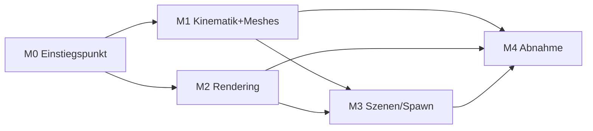

# Umsetzungsplan v3 – SegelPhysik: Kinematische Körperdemo

> ## ⚠️ VORBEMERKUNG – VORRANGIGE ANWEISUNG (gilt vor allen Abschnitten dieses Plans)
>
> **DAS REPO WIRD UNANGETASTET GELASSEN. Es werden AUSSCHLIESSLICH NEUE Dateien,
> Funktionen und Module ERZEUGT, die für V3 benötigt werden.**
>
> - **Keine Löschungen, keine Umbenennungen, keine Änderungen an bestehenden
>   Dateien.** Der gesamte Bestand (inkl. sämtlicher Physik: Solver, Forces,
>   Bodies, SPH, Fluid, Kollisionen, Druckfeld, Dichte-/Massenintegration)
>   bleibt unverändert im Repo vorhanden.
> - **V3 lebt ausschließlich von neuen Bestandteilen:** neuer
>   Einstiegspunkt (`app_v3.py`), neue Kinematik (`core/kinematics.py`),
>   neue Geometrie-Fabrik (`core/meshes.py`), neue UI-Module (`ui_v3.py`)
>   und neue Tests (`tests/test_v3_*.py`). Diese laden KEINE Physik-Module;
>   sie importieren aus dem Altbestand ausschließlich rein Grafisches
>   (Rendering-Pipeline, Zweiton-Körper, Wasserlinien-Kontur, Tiefenfärbung,
>   Gitter, Maßstabsleiste, HUD, Wasserebene bei z = 0 – unverändert aus v0.4).
> - **Physik ist damit aus der V3-Anwendung vollständig entfernt** – nicht
>   durch Löschung, sondern dadurch, dass der V3-Einstiegspunkt sie nicht
>   referenziert. Sie ist nicht Teil der V3-Abnahme.
> - **Das Koordinatensystem bleibt:** rechtshändig, z nach oben, Ursprung auf
>   der Wasseroberfläche, x Richtung Bug, y nach Backbord; Becken 10×10×9 m;
>   SI-Einheiten. Es wird nicht geändert und nicht neu definiert.
> - **RÜCKFALLEBENEN-REGEL:** Sämtliche V3-Arbeit erfolgt im Branch `v3`;
>   `main` bleibt unangetastet und ist jederzeitige Rückfallebene auf den
>   alten Stand. Vor Beginn wird zur Sicherheit der Tag `pre-v3-fallback`
>   auf `main` gesetzt.
>
> Jede Aufgabe in den Abschnitten 1–5 ist im Lichte dieser Vorbemerkung zu
> lesen. Bei Konflikt gilt die Vorbemerkung vor dem Abschnittstext.

**Status:** Verbindlicher Umsetzungsplan zu SPEC_v3.md (Version 3.0)
**Datum:** 10.10.2026
**Basis:** doc/SPEC_v3.md (Version 3.0) · ersetzt doc/UMSETZUNGSPLAN_v2.md vollständig
(M1–M5 der v2-Planung entfallen mit der Physik; nur M6-Teile und M7 leben in
angepasster Form weiter – siehe M3/M4 hier)

---

## 0. Leitlinien

1. **Additivprinzip vorrangig:** Gemäß Vorbemerkung wird nichts gelöscht oder
   geändert; V3 besteht nur aus neuen Dateien. Die Abnahme prüft ausschließlich,
   was in SPEC_v3.md steht; zusätzlich gilt: der V3-Einstiegspunkt lädt keine
   Physik-Module (per Import-Scan prüfbar). `main` bleibt unangetastet.
2. **Ein Meilenstein = ein Branch-Stand = ein Testreport.** Commit-Style:
   `[v3][M<n>] <Kurzbeschreibung> (SPEC_v3 §<x>)`.
3. **Die Animation ist eine geschlossene Funktion der Uhr** – keine Zustands-
   gleichungen, kein Integrator. Alles, was nicht aus φ(t) = ω·t folgt, ist
   ein Fehler gegen §4.
4. **Physik-Rückkehr ist V4-Vorbehalt (Spec §10):** Der Altbestand bleibt als
   Referenz erhalten; neue Module werden so geschnitten, dass V4-Physik sie
   als Consumer nutzen kann (insbesondere `core/meshes.py`, siehe M1), ohne
   sie anzufassen. Keine Brücken bauen, die eine saubere V4-Spezifikation
   erschweren.

---

## 1. Meilensteine

### M0 – Branch, neuer Einstiegspunkt & UI-Rückbau (additiv) (≈ 0,5 d)
Branch `v3` von `main` anlegen; Sicherheitshalber Tag `pre-v3-fallback` setzen.
- **Neu:** `segelphysik/app_v3.py` als Einstiegspunkt der V3-Anwendung.
  Erzeugt Szene, Uhr und Fenster ohne jeden Physik-Import.
- **Neu:** `segelphysik/ui_v3.py` – Kontrollpanel gemäß Spec §6: Spawn-Auswahl
  (3 Körper), Start/Pause/Reset, Wiedergabefaktor 0,25×–4×, Kamera.
  Entfallene Regler (g, Dämpfung c, μ/e, Dichteprofil, Wind) werden schlicht
  nicht erzeugt – die alten UI-Dateien bleiben unberührt.
- Status-Panel (neu, in `ui_v3.py`) auf Animationsgrößen (Spec §5): Körpertyp,
  φ(t), Umdrehungsnummer, Animationszeit, RTF, FPS. Keine Kraft-/Massenanzeigen.
- Kraft-/Geschwindigkeitspfeile und Momentenarm werden im neuen Renderpfad
  schlicht nicht hinzugefügt.
- **Abnahme:** `app_v3.py` startet ohne Physik-Imports (Import-Scan grün);
  neue Test-Runner-Konfiguration führt nur `tests/test_v3_*.py` aus und ist grün;
  `git status` zeigt keine Änderungen an Altbestand-Dateien.

### M1 – Kinematik-Kern & Geometrie-Fabrik (≈ 0,5 d) ⚠️ Herzstück
**Neu `segelphysik/core/kinematics.py`:**
- φ(t) = ω·t, ω = 2π/15 rad/s (aus Szenen-JSON konfigurierbar),
  Drehachse default Welt-y durch r_S, r_S fixiert (0,0,0) (D1/D2),
  φ(0) = 0 ⇒ aufrecht (D3), Reset setzt t = 0.
- Animationsuhr: Δt = 1/240 s Akkumulator-Muster, Pause/Single-Step friert
  die Uhr ein, Wiedergabefaktor skaliert ω effektiv (Zeitlupe = kleinere
  φ-Schritte, exakt derselbe Pfad).
- Orientierungsmatrix je Substep aus φ(t) geschlossen berechnet
  (kein Integrator!) – deterministisch und reproduzierbar.
- **Tests:** φ(15 s) = 360° ± 0,01° (K1″); r_S konstant ± 1 mm (K2″);
  bitidentische φ(t)-Folgen über 1.000 Substeps (K7″); Pause/Step-Verhalten;
  Wiedergabefaktor-Skalierung; JSON-Rundtrip (Körper, Achse, ω, Startphase).

**Neu `segelphysik/core/meshes.py` (Geometrie-Fabrik, V4-vorbereitet):**
- Reine Funktionen `build_cone(H, R)`, `build_box(dx, dy, dz)`,
  `build_pyramid(a, H)` → `(vertices, faces)` im Körperframe, Ursprung im
  Schwerpunkt gemäß Spec §3 (Kegel/Pyramide: H/4 über der Basis).
- **Keine** Parameter für Dichte, Masse oder Kräfte – rein geometrisch.
- **V4-Schnittstelle (dokumentiert im Modulkopf):** die späteren Physik-Module
  (Volumen-/Schwerpunktintegration, Ebenen-Clip für V_sub, Masseneigenschaften)
  konsumieren genau diese Meshes; der Altbestand `core/bodies.py` dient dabei
  nur als Referenz, nicht als Importquelle.
- **Tests:** Vertex-/Face-Zahlen, Schwerpunktlage der Meshes (geometrisch,
  gegen geschlossene Formeln), Roundtrip Abmessungen ↔ Bounding-Box.

### M2 – Rendering-Anpassungen (≈ 1 d)
- Zweiton-Färbung gegen Ebene z = 0 rein geometrisch: Mesh-Vertices mit
  z < 0 = „unter Wasser" (Spec §5 – Wortlaut „Schwerpunktz" ist im Review als
  „Vertex-z" präzisiert). Kein Physik-Zugriff.
- Wasserlinien-Kontur: Schnittkurve Körper ∩ Ebene z = 0 je Frame, alle drei
  Körpertypen, mindestens 5 Prüfphasen automatisiert (K4″).
- Tiefenfärbung, Gitter, Maßstabsleiste, HUD, Becken: unverändert übernehmen
  (Import aus dem Altbestand, ohne ihn zu ändern).
- Z-Fighting an der Ebene prüfen (kleiner Polygon-Offset der Wasserebene im
  neuen Renderpfad, falls nötig) – K5″.
- **Tests:** Stichproben-Vertex-Klassifikation (K3″); Kontur-Existenz je
  Phase (K4″); Render-Smoke-Test pro Körpertyp.

### M3 – Szenen-JSON & Mehrfach-Spawn (≈ 0,5 d)
- Szenen-JSON: Körpertyp, Abmessungen, Rotationsachse, ω, Startphase
  (Default 0), Position pro Körper.
- Default-Szene: genau ein Körper bei r_S = (0,0,0) (D2 unverändert).
- Mehrfach-Spawn per Szenen-JSON mit expliziten Positionen (z. B. x = −2/0/+2)
  – Voraussetzung für K6″. UI-Klick-Spawn bleibt „genau einer".
- ⚠️ **`spec-deviation`:** Das Feld `position` ist in Spec §7 nicht gelistet
  (Herleitung: Variante (a) aus dem Spec-Review, Auflösung des D2-Spannungs-
  verhältnisses). Eintrag mit Begründung im Testreport M3 erforderlich.
- **Tests:** Rundtrip JSON ↔ Szene; 3-Körper-Szene lädt und animiert.

### M4 – Abnahme & Release (≈ 0,5 d)
- K1″–K8″ durchprüfen (QUICK-Kriterien automatisiert, K5″/K6″ manuell).
- Testreport je Kriterium mit Messwerten (φ-Fehler, r_S-Abweichung,
  FPS-Zahl, Substep-Vergleichs-Hash).
- Release-Notes v3.0; Tag `spec-v3.0` bzw. Release-Tag `v3.0.0` (auf `v3`).
- Repo-Hygiene entfällt weitgehend: Da nichts gelöscht/geändert wird, bleibt
  auch `__pycache__` unberührt (optionaler Aufräume-Commit erst nach dem
  Release-Merge, wenn main wieder offen ist).

---

## 2. Zuordnung Akzeptanzkriterien → Meilensteine

| Kriterium | Meilenstein | Art |
|---|---|---|
| K1″ Rotation exakt 360°/15 s | M1 | QUICK |
| K2″ Schwerpunkt fix | M1 | QUICK |
| K3″ Zweiton-Färbung | M2 | QUICK |
| K4″ Wasserlinien-Kontur | M2 | QUICK |
| K5″ Rendering sauber | M2 | manuell |
| K6″ ≥ 60 FPS @ 3 Körper | M3/M4 | manuell/Hardware |
| K7″ Determinismus | M1 | QUICK |
| K8″ Suite grün (nur test_v3_*) | M0–M4 | QUICK |

Lückenlos: alle acht Kriterien sind zugeordnet.

---

## 3. Abhängigkeitsgraph

Kritischer Pfad: M0 → M1 → M3 → M4 (ca. 2 Arbeitstage Gesamtumfang).

---

## 4. Risiken

| Risiko | Gegenmaßnahme |
|---|---|
| V3-Einstiegspunkt lädt versehentlich Physik-Module (versteckte Kopplung über Alt-Imports) | Import-Scan im Test: `app_v3`, `ui_v3`, `core/kinematics`, `core/meshes` dürfen core/forces, core/solver, core/bodies, core/sph, core/fluid, fluid/ nicht referenzieren |
| Z-Fighting Körper↔Wasserebene bei exakt halb eingetauchten Körpern | Polygon-Offset / Tiefe-Bias der Ebene im neuen Renderpfad, früh in M2 verifizieren |
| Wiedergabefaktor ändert Pfad (Zeitlupe ≠ Echtzeit-Pfad) | Faktor wirkt nur auf die Uhr; φ(t) bleibt eine einzige geschlossene Formel – Test K7″ mit 0,25× und 4× wiederholen |
| Mehrfach-Spawn ohne Positionen → deckungsgleiche Körper | Szenen-Validierung: Positionen pflicht bei > 1 Körper (M3) |
| Versehentliche Änderungen am Altbestand | `git status` muss in jedem M-Testreport „clean bezüglich Altbestand" zeigen; alle Arbeit im Branch `v3`; Fallback-Tag `pre-v3-fallback` |

---

## 5. Arbeitsvereinbarungen

- Testreport je Meilenstein (Markdown, `doc/reports/v3_M<n>.md`) mit
  Messwerten statt Ja/Nein.
- Spec-Abweichungen nur mit Label `spec-deviation` und Eintrag im Testreport
  (aktuell bekannt: `position`-Feld in M3).
- Kein Refactoring; bestehende Dateien werden nicht angetastet – V3 lebt
  ausschließlich von neuen Dateien (siehe Vorbemerkung).
- Alle Commits landen ausschließlich im Branch `v3`. `main` bleibt unangetastet
  und ist jederzeitige Rückfallebene auf den alten Stand (Tag `pre-v3-fallback`).
